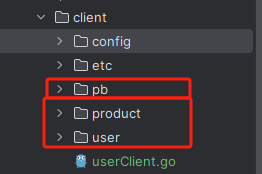

演示通过user.proto来创建一个完整的 gRPC 服务

## 一、user服务的服务端代码编写

### 1、快速生成user.proto文件

```sh
goctl rpc -o user.proto
```

### 2、编辑user.proto文件（可选）

```
syntax = "proto3";

package user;
option go_package="./user";

message UserReq {
  string id = 1;
  string name = 2;
  int32 age = 3;

}

message UserResp {
  string id = 1;
  string name = 2;
  int32 age = 3;
  string status=4;

}

service User {
  rpc Create(UserReq) returns(UserResp);
}


message ProductReq {
  string id = 1;
  string name = 2;
  fixed64 price = 3;

}

message ProductResp {
  string id = 1;
  string name = 2;
  fixed64 price = 3;
  string status=4;

}
service Product{
  rpc Create(ProductReq) returns(ProductResp);
}

```

### 3、使用goctl rpc protoc来生成项目代码

```sh
 goctl rpc protoc user.proto --go_out=./pb --go-grpc_out=./pb --zrpc_out=. --client=true -m
```

生成完成后的目录结构为：

```go
│  user.go
│  user.proto
│
├─client
│  ├─product
│  │      product.go
│  │
│  └─user
│          user.go
│
├─etc
│      user.yaml
│
├─internal
│  ├─config
│  │      config.go
│  │
│  ├─logic
│  │  ├─product
│  │  │      createlogic.go
│  │  │
│  │  └─user
│  │          createlogic.go
│  │
│  ├─server
│  │  ├─product
│  │  │      productserver.go
│  │  │
│  │  └─user
│  │          userserver.go
│  │
│  └─svc
│          servicecontext.go
│
└─pb
    └─user
            user.pb.go
            user_grpc.pb.go
```


### 4、进入到etc目录，注释掉etcd相关配置

这里演示使用直连方式，不适用etcd进行RPC服务的注册。如果需要使用etcd进行服务的注册，那么

```
Name: user.rpc
ListenOn: 0.0.0.0:8080
#Etcd:
#  Hosts:
#  - 127.0.0.1:2379
#  Key: user.rpc
```

### 5、编写业务逻辑代码

go-zero-learn/rpc/server/internal/user/createlogic.go

​	修改Create的方法的逻辑。这里简单的将UserReq对象进行属性进行简单的拷贝返回。

```go
func (l *CreateLogic) Create(in *user.UserReq) (*user.UserResp, error) {
	l.Logger.Info(in)
	return &user.UserResp{
		Id:   in.Id,
		Name: in.Name,
		Age:  in.Age,
	}, nil
}
```

## 二、user服务的客户端代码编写

### 1、将原来服务端pb目录及client包下所有的文件拷贝到额外新建的client的目录中



### 2、编写客户端的配置文件

client/etc/user_client.yaml

```yaml
Endpoints:
  - 127.0.0.1:8080
```

### 3、编写客户端配置类

client/config/config.go

```go
package config

import "github.com/zeromicro/go-zero/zrpc"

type Config struct {
	zrpc.RpcClientConf
}

```

### 4、编写客户端的启动类

client/userClient.go

```go
package main

import (
	"context"
	"flag"
	"github.com/google/uuid"
	"github.com/zeromicro/go-zero/core/conf"
	"github.com/zeromicro/go-zero/zrpc"
	"go-zero-learn/rpc/client/config"
	"go-zero-learn/rpc/client/user"
	"log"
)

var configFile = flag.String("f", "etc/user_client.yaml", "the config file")

func main() {
	flag.Parse()
	var c config.Config
	conf.MustLoad(*configFile, &c)
	conn := zrpc.MustNewClient(c.RpcClientConf)
	client := user.NewUser(conn)
	resp, err := client.Create(context.Background(), &user.UserReq{
		Id:   uuid.NewString(),
		Name: "zhang",
		Age:  16,
	})
	if err != nil {
		log.Println(err)
		return
	}
	log.Println(resp)
}
```

## 三、测试user RPC服务

1、在server目录下使用如下命令运行

```sh
go run user.go
```

2、在client目录下使用如下命令运行

```sh
 go run .\userClient.go
```

输出格式为：

```txt
{"@timestamp":"2024-09-09T17:06:00.493+08:00","caller":"p2c/p2c.go:195","content":"p2c - conn: 127.0.0.1:8080, load: 1224, reqs: 1","level":"stat"}
2024/09/09 17:06:00 id:"26fcfb80-a1bd-412e-aa4e-a991b4a49e8b" name:"zhang" age:16
```

